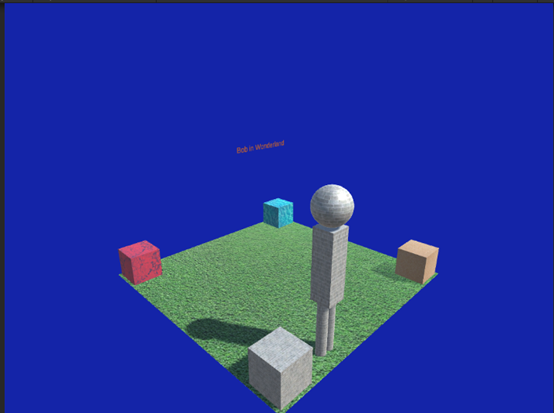

# Bob in Wonderland — Unity 3D

Interactive Unity 3D scene. The player controls “Bob” on a textured plane, collides with corner cubes to adopt their materials, and scales up or down on specific cubes. A simple free camera orbits and changes height. Optional collision sound. Five speed levels. Designed for clear structure and reproducible builds.

## Demo

 

## Features

* **3D Scene**

  * Ground plane \~80×80 units with a ground texture. Background color set to dark blue. Target resolution 1024×768.
* **Player: Bob**

  * Built from primitives: sphere (head, scale 5), cuboid body (3×10×3), two cylinders for legs (1.5×4×1.5). Grouped under one parent for unified transforms.&#x20;
* **Corner Cubes**

  * Four static cubes with distinct materials. On collision Bob adopts the cube’s material. Two special cubes along one diagonal scale Bob up or down.&#x20;
* **Camera**

  * Free view of the scene from any angle and height. Keyboard control for planar movement and vertical translation.&#x20;
* **Audio**

  * Collision sound via `AudioSource` on hit with cubes. Debounced to avoid overlap.&#x20;
* **Speed Levels**

  * Five discrete movement speeds.&#x20;

## Controls

### Bob

* Move on world axes: `A/D` → X, `S/X` → Z, `W/E` → Y (height). Clamp to ground bounds.&#x20;
* Speed presets: keys `1–5`.&#x20;

### Camera

* Arrows: move/rotate to observe the scene in X–Z plane.
* `+ / -`: move along world Y (height). Implemented with `Translate` and `RotateAround`.

## Tech Specs

* Unity **2022.3.15f1**, Windows 11, Visual Studio Community 2022.&#x20;
* Plane scaled to roughly 80×80 (Unity default plane is 10×10, so use scale X:8, Z:8). MeshCollider on ground.&#x20;
* Bob and cubes: colliders enabled. Material swapping via `GetComponentInChildren<Renderer>()`.&#x20;
* Target Game view: 1024×768. Title: “Bob in Wonderland”.&#x20;

## Repository Structure

```
.
├─ Assets/
│  ├─ Scripts/
│  │  ├─ PlayerController.cs       # Bob movement, speed levels, bounds
│  │  ├─ BobCollision.cs           # Material swap, scale up/down, collision SFX
│  │  └─ CameraController.cs       # Orbit/translate camera controls
│  ├─ Audio/                       # Collision sound
│  ├─ Materials/                   # Materials for Bob and cubes
│  ├─ Textures/                    # Ground and cube textures
│  └─ Scenes/                      # Main scene
├─ excecutable/
│  └─ Bob in Wonderland.exe        # Prebuilt Windows executable
├─ ProjectSettings/
├─ Packages/
└─ README.md
```

## Getting Started

1. Install Unity **2022.3.15f1** (or compatible LTS).&#x20;
2. **Open** the project folder in Unity Hub.
3. Load the main scene from `Assets/Scenes`.
4. Press **Play**.

## Build

1. `File → Build Settings…`
2. Select platform (e.g., Windows), add the active scene.
3. In Game view use preset **1024×768**. Ensure background is dark blue and title is visible.&#x20;
4. Click **Build** to produce an `.exe`.

## Run the Prebuilt Executable

* Navigate to `excecutable/Bob in Wonderland.exe` and run it.
* If Windows SmartScreen warns, choose “More info → Run anyway.”

## Implementation Notes

* **Bounds and scaling:** Movement clamped so Bob remains on the plane even after scale changes.
* **Material adoption:** On collision, Bob copies the cube’s material to all child renderers.&#x20;
* **Audio debounce:** Play hit SFX only when `AudioSource` is not already playing.&#x20;
* **Input mapping:** Camera arrows bound to Horizontal/Vertical. `+/-` mapped for Y translation in world space.&#x20;

