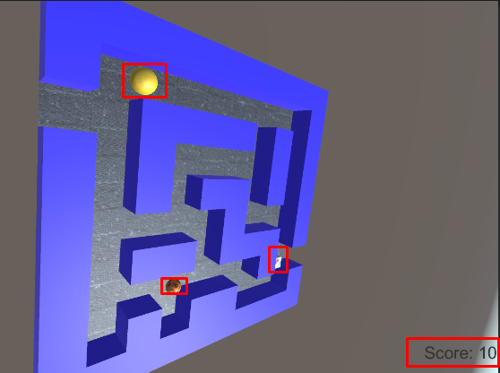

# Treasure Bob (Unity 3D)

Top-down maze mini-game. You steer **Treasure Bob** through a block-maze, collect rotating “treasures,” avoid random traps, and watch a simple score and game-over flow. Windowed 1024×768, product name “Project 2 – Treasure Bob.”&#x20;


## Features

* **Maze + Floor**

  * Floor on y=0. Visual grid about 100×100. Blue wall cubes form the maze. Center near (0,0,5).&#x20;
* **Player**

  * Sphere avatar. Fixed height. No gravity. Starts at the maze entrance. Cannot pass walls or leave bounds. Movement with discrete steps.&#x20;
* **Treasures**

  * Three cube types with distinct textures. Spawn at random legal positions for limited lifetime. On pickup they shrink and vanish. Optional particles and pickup sound.
* **Traps**

  * Randomly spawned spheres. Touching one ends the run and triggers a Game Over panel.
* **Score**

  * Points per treasure type. Simple UI text update.&#x20;
* **Camera**

  * Keyboard-controlled planar motion, height change, and self-rotation.&#x20;

## Controls

* **Bob:** `j` left, `l` right (X axis). `i` forward, `k` backward (Z axis).
* **Speed:** `Z` slower, `X` faster. Five levels.
* **Camera:** arrows move on X/Z. `+` up, `-` down (Y). `r` rotate around Y.

## Tech notes

* Wall collision via physics checks (e.g., BoxCast/CheckBox with wall LayerMask). Bob motion clamped to floor bounds. Treasures and traps validated against walls before spawn. Simple singleton score manager. Basic UI (Text/TMP).&#x20;
* Target resolution 1024×768 windowed. Title “Project 2 – Treasure Bob.”&#x20;

## Repository layout (suggested)

```
TreasureBob/
  Assets/
    Scripts/           # BobMovement.cs, Treasure.cs, TreasureSpawner.cs,
                       # TrapSpawner.cs, ScoreManager.cs, GameOverManager.cs,
                       # CameraController.cs
    Materials/
    Textures/
    Prefabs/
    Audio/
    Scenes/
  Treasure Bob builder/
    Treasure Bob.exe   # Prebuilt Windows executable
  README.md
```

## Run

* Double-click `Treasure Bob builder/Treasure Bob.exe`. If SmartScreen warns, choose “More info → Run anyway.”&#x20;

## Build

1. `File → Build Settings…` → select platform and add the main scene.
2. `Player Settings → Resolution and Presentation`: set **1024×768**, windowed. Set **Product Name** to “Project 2 – Treasure Bob.”
3. Build.&#x20;

